# 00. CSAPP 11 전체 로드맵

이 페이지의 목적은 세 가지입니다.

- `CSAPP` 11장 전체를 한 장에서 본다
- 어디까지 학습했는지 체크한다
- 동료와 화이트보드로 설명할 때 공통 뼈대로 사용한다

## 사용 방법

- 발표 전:
  전체 흐름을 한 번 훑는다
- 학습 중:
  각 노드가 설명 가능한지 체크한다
- 화이트보드 설명 시:
  가운데에서 바깥으로 확장하며 설명한다

## 한 장 로드맵

```mermaid
flowchart TD
    A["CSAPP 11 Network Programming"]

    A --> B["11.1 Client-Server Model"]
    B --> B1["client"]
    B --> B2["server"]
    B --> B3["resource"]
    B --> B4["transaction: request -> process -> response"]

    A --> C["11.2 Networks"]
    C --> C1["LAN"]
    C --> C2["router"]
    C --> C3["internet"]
    C --> C4["frame"]
    C --> C5["packet"]
    C --> C6["encapsulation"]

    A --> D["11.3 Global IP Internet"]
    D --> D1["IP address"]
    D --> D2["network byte order"]
    D --> D3["domain name / DNS"]
    D --> D4["port"]
    D --> D5["socket address"]
    D --> D6["connection / socket pair"]

    A --> E["11.4 Sockets Interface"]
    E --> E1["socket"]
    E --> E2["connect"]
    E --> E3["bind"]
    E --> E4["listen"]
    E --> E5["accept"]
    E --> E6["getaddrinfo / getnameinfo"]
    E --> E7["open_clientfd / open_listenfd"]
    E --> E8["echo client/server"]

    A --> F["11.5 Web Servers"]
    F --> F1["URL / URI"]
    F --> F2["static content"]
    F --> F3["dynamic content"]
    F --> F4["HTTP request"]
    F --> F5["HTTP response"]
    F --> F6["header / body / CRLF"]
    F --> F7["CGI"]

    A --> G["11.6 Tiny Web Server"]
    G --> G1["main"]
    G --> G2["doit"]
    G --> G3["read_requesthdrs"]
    G --> G4["parse_uri"]
    G --> G5["serve_static"]
    G --> G6["serve_dynamic"]
    G --> G7["mmap / fork / execve / dup2 / wait"]

    A --> H["11.7 Summary"]
    H --> H1["from naming to connection"]
    H --> H2["from socket to HTTP server"]
    H --> H3["from Tiny to Proxy / API server"]

    A --> I["This Week Expansion"]
    I --> I1["Echo"]
    I --> I2["Tiny"]
    I --> I3["Proxy Lab"]
    I --> I4["concurrency"]
    I --> I5["cache"]
    I --> I6["SQL API server"]
```



## 화이트보드 설명 순서

아래 순서대로 설명하면 흐름이 가장 자연스럽습니다.

1. `11.1`
   클라이언트와 서버가 무엇인지
2. `11.2`
   요청 데이터가 네트워크를 어떻게 타는지
3. `11.3`
   이름, 주소, 포트, 연결이 어떻게 이어지는지
4. `11.4`
   코드에서 어떤 함수로 연결을 만드는지
5. `11.5`
   HTTP 서버는 무엇을 주고받는지
6. `11.6`
   Tiny가 이 개념을 어떻게 코드로 합치는지
7. `11.7`
   이 지식을 Proxy와 SQL API 서버로 어떻게 확장하는지

## 완료 체크

아래 항목을 설명할 수 있으면 전체 로드맵을 따라간 것입니다.

- `client`, `server`, `resource`, `transaction`
- `LAN`, `router`, `packet`, `frame`, `encapsulation`
- `IP`, `DNS`, `port`, `socket address`, `connection`
- `socket`, `connect`, `bind`, `listen`, `accept`
- `getaddrinfo`, `open_clientfd`, `open_listenfd`
- `URL`, `HTTP request`, `HTTP response`, `header`, `body`
- `static`, `dynamic`, `CGI`
- `Tiny main`, `doit`, `parse_uri`, `serve_static`, `serve_dynamic`
- `Proxy`, `concurrency`, `cache`
- `SQL API server`로의 연결

## 가장 중요한 한 줄

```text
이름을 주소로 바꾸고
주소로 연결을 만들고
연결 위에 HTTP를 흘리고
그 HTTP를 코드로 처리하면 Tiny / Proxy / API 서버가 된다
```
