# 02. 학습 키워드 트리

모든 키워드를 하나의 종속 관계 트리로 정리한 문서입니다.
위에서 아래로 읽으면 개념이 어떻게 쌓이는지 보입니다.

## 전체 키워드 트리

```mermaid
graph TD
    ROOT["CSAPP 11: Network Programming"]

    ROOT --> A["Client-Server Model"]
    A --> A1["client: 서비스를 요청하는 프로세스"]
    A --> A2["server: 자원을 관리하고 서비스하는 프로세스"]
    A --> A3["transaction"]
    A3 --> A3a["1. client sends request"]
    A3 --> A3b["2. server processes request"]
    A3 --> A3c["3. server sends response"]
    A3 --> A3d["4. client processes response"]

    ROOT --> B["Network Hardware"]
    B --> B1["LAN"]
    B1 --> B1a["Ethernet segment"]
    B1a --> B1a1["hub: 모든 포트에 비트 복사"]
    B1a --> B1a2["frame: 헤더 + payload"]
    B1a --> B1a3["MAC address: 48-bit 고유 주소"]
    B1 --> B1b["bridged Ethernet"]
    B1b --> B1b1["bridge: 포트별 선택 전달"]
    B --> B2["WAN"]
    B --> B3["router"]
    B3 --> B3a["서로 다른 LAN/WAN을 연결"]
    B3 --> B3b["routing table로 패킷 전달"]
    B --> B4["internet = LAN + WAN + router"]
    B4 --> B4a["protocol: 이기종 네트워크를 통합하는 규약"]
    B4a --> B4a1["naming scheme: 균일한 주소 형식"]
    B4a --> B4a2["delivery mechanism: packet 단위 전달"]
    B4 --> B4b["encapsulation"]
    B4b --> B4b1["data -> internet packet -> LAN frame"]

    ROOT --> C["Global IP Internet"]
    C --> C1["IP address"]
    C1 --> C1a["32-bit unsigned integer"]
    C1 --> C1b["struct in_addr"]
    C1 --> C1c["network byte order: big-endian"]
    C1c --> C1c1["htonl / htons: host -> network"]
    C1c --> C1c2["ntohl / ntohs: network -> host"]
    C1 --> C1d["dotted-decimal notation"]
    C1d --> C1d1["inet_pton: 문자열 -> binary"]
    C1d --> C1d2["inet_ntop: binary -> 문자열"]
    C --> C2["DNS"]
    C2 --> C2a["domain name: 사람이 읽는 주소"]
    C2a --> C2a1["계층 구조: root > com/edu > cmu > cs"]
    C2 --> C2b["DNS lookup: domain -> IP"]
    C2b --> C2b1["nslookup / dig 명령"]
    C2 --> C2c["localhost = 127.0.0.1"]
    C --> C3["Internet connection"]
    C3 --> C3a["point-to-point"]
    C3 --> C3b["full duplex: 양방향 동시 통신"]
    C3 --> C3c["reliable: 순서 보장"]
    C3 --> C3d["socket: 연결의 끝점"]
    C3d --> C3d1["socket address = IP:port"]
    C3d --> C3d2["ephemeral port: 클라이언트에 커널이 자동 할당"]
    C3d --> C3d3["well-known port: 서버 고정 포트"]
    C3d3 --> C3d3a["80 = HTTP, 25 = SMTP, 443 = HTTPS"]
    C3 --> C3e["socket pair"]
    C3e --> C3e1["cliaddr:cliport, servaddr:servport"]
    C3e --> C3e2["연결을 유일하게 식별하는 4-tuple"]

    ROOT --> D["Sockets Interface"]
    D --> D0["TCP/IP"]
    D0 --> D0a["IP: host-to-host 패킷 전달, 비신뢰"]
    D0 --> D0b["UDP: process-to-process, 비신뢰"]
    D0 --> D0c["TCP: 신뢰성 있는 양방향 연결"]
    D --> D1["socket address 구조체"]
    D1 --> D1a["sockaddr_in: AF_INET + port + IP"]
    D1 --> D1b["sockaddr: 범용 구조체, 캐스팅용"]
    D1 --> D1c["sockaddr_storage: 프로토콜 독립적"]
    D --> D2["서버 생명주기"]
    D2 --> D2a["socket: 소켓 디스크립터 생성"]
    D2a --> D2a1["AF_INET + SOCK_STREAM + 0"]
    D2 --> D2b["bind: 소켓에 주소 바인딩"]
    D2b --> D2b1["커널에게 이 주소로 요청 받겠다고 알림"]
    D2 --> D2c["listen: passive 소켓으로 전환"]
    D2c --> D2c1["backlog: 대기 큐 크기 힌트"]
    D2 --> D2d["accept: 연결 수락, connfd 반환"]
    D2d --> D2d1["listenfd: 연결 요청 대기용, 서버 수명 동안 유지"]
    D2d --> D2d2["connfd: 실제 통신용, 요청 처리 후 close"]
    D2 --> D2e["read / write: 데이터 송수신"]
    D2 --> D2f["close: 연결 종료"]
    D --> D3["클라이언트 생명주기"]
    D3 --> D3a["socket: 소켓 디스크립터 생성"]
    D3 --> D3b["connect: 서버에 연결 요청"]
    D3b --> D3b1["성공 시 clientfd로 읽기/쓰기 가능"]
    D3 --> D3c["read / write"]
    D3 --> D3d["close"]
    D --> D4["getaddrinfo"]
    D4 --> D4a["hostname + service -> addrinfo linked list"]
    D4 --> D4b["프로토콜 독립적: IPv4/IPv6 모두 지원"]
    D4 --> D4c["hints로 필터링"]
    D4c --> D4c1["AI_PASSIVE: 서버용 wildcard 주소"]
    D4c --> D4c2["AI_ADDRCONFIG: 로컬 설정 기반 필터"]
    D4c --> D4c3["AI_NUMERICSERV: 포트 번호 강제"]
    D4 --> D4d["freeaddrinfo: 메모리 해제 필수"]
    D --> D5["getnameinfo"]
    D5 --> D5a["sockaddr -> hostname + service 문자열"]
    D5 --> D5b["NI_NUMERICHOST: IP 문자열 반환"]
    D --> D6["helper 함수"]
    D6 --> D6a["open_clientfd: socket + connect 래핑"]
    D6 --> D6b["open_listenfd: socket + bind + listen 래핑"]
    D6b --> D6b1["SO_REUSEADDR: Address already in use 방지"]
    D --> D7["Echo client/server"]
    D7 --> D7a["iterative server: 한 번에 한 클라이언트"]
    D7 --> D7b["rio_readlineb / rio_writen: robust I/O"]
    D7 --> D7c["EOF: read가 0을 반환하는 조건"]

    ROOT --> E["Web Servers"]
    E --> E1["HTTP"]
    E1 --> E1a["text-based application-level protocol"]
    E1 --> E1b["request-response 구조"]
    E --> E2["Web content"]
    E2 --> E2a["MIME type"]
    E2a --> E2a1["text/html, text/plain, image/png, image/gif ..."]
    E2 --> E2b["static content: 디스크 파일 반환"]
    E2 --> E2c["dynamic content: 프로그램 실행 결과 반환"]
    E --> E3["URL"]
    E3 --> E3a["http://host:port/path?args"]
    E3 --> E3b["클라이언트: host:port로 서버 위치 결정"]
    E3 --> E3c["서버: /path로 파일 위치 결정"]
    E3 --> E3d["? 뒤: CGI 인자, & 로 구분"]
    E --> E4["HTTP request"]
    E4 --> E4a["request line: method URI version"]
    E4a --> E4a1["GET /index.html HTTP/1.1"]
    E4 --> E4b["request headers: key: value"]
    E4b --> E4b1["Host: 필수 (HTTP/1.1)"]
    E4b --> E4b2["User-Agent, Connection, Proxy-Connection"]
    E4 --> E4c["빈 줄 (CRLF): 헤더 종료"]
    E4 --> E4d["request body: POST에서 사용"]
    E --> E5["HTTP response"]
    E5 --> E5a["response line: version status-code status-message"]
    E5a --> E5a1["HTTP/1.0 200 OK"]
    E5 --> E5b["response headers"]
    E5b --> E5b1["Content-Type: 응답 MIME 타입"]
    E5b --> E5b2["Content-Length: 응답 body 바이트 수"]
    E5 --> E5c["빈 줄: 헤더 종료"]
    E5 --> E5d["response body: 실제 콘텐츠"]
    E --> E6["CGI"]
    E6 --> E6a["서버가 fork -> execve로 프로그램 실행"]
    E6 --> E6b["QUERY_STRING 환경변수로 인자 전달"]
    E6 --> E6c["dup2로 stdout을 connfd에 연결"]
    E6 --> E6d["CGI 프로그램이 Content-type, Content-length 직접 출력"]
    E6 --> E6e["환경변수: SERVER_PORT, REQUEST_METHOD, REMOTE_HOST ..."]

    ROOT --> F["Tiny Web Server"]
    F --> F1["main"]
    F1 --> F1a["open_listenfd로 리스닝 시작"]
    F1 --> F1b["while(1): accept -> doit -> close"]
    F --> F2["doit"]
    F2 --> F2a["request line 읽기 + 파싱"]
    F2 --> F2b["GET만 지원, 나머지는 501 에러"]
    F2 --> F2c["read_requesthdrs: 헤더 소비"]
    F2 --> F2d["parse_uri 호출"]
    F2 --> F2e["static이면 serve_static"]
    F2 --> F2f["dynamic이면 serve_dynamic"]
    F --> F3["parse_uri"]
    F3 --> F3a["URI에 cgi-bin 포함 -> dynamic"]
    F3 --> F3b["아니면 -> static"]
    F3 --> F3c["filename과 cgiargs 분리"]
    F --> F4["serve_static"]
    F4 --> F4a["stat으로 파일 존재/권한 확인"]
    F4 --> F4b["get_filetype으로 MIME 결정"]
    F4 --> F4c["응답 헤더 전송"]
    F4 --> F4d["mmap으로 파일을 메모리에 매핑"]
    F4 --> F4e["rio_writen으로 클라이언트에 전송"]
    F4 --> F4f["munmap으로 매핑 해제"]
    F --> F5["serve_dynamic"]
    F5 --> F5a["응답 라인 + Server 헤더 전송"]
    F5 --> F5b["fork로 자식 프로세스 생성"]
    F5 --> F5c["setenv로 QUERY_STRING 설정"]
    F5 --> F5d["dup2로 stdout -> connfd 리다이렉트"]
    F5 --> F5e["execve로 CGI 프로그램 실행"]
    F5 --> F5f["부모는 wait로 자식 종료 대기"]

    ROOT --> G["이번 주 확장"]
    G --> G1["Echo server"]
    G1 --> G1a["소켓 기초 확인"]
    G --> G2["Tiny 완성"]
    G2 --> G2a["static + dynamic 서빙 동작 확인"]
    G --> G3["숙제 문제"]
    G3 --> G3a["11.6c: MIME 처리"]
    G3 --> G3b["11.7: HEAD 메서드"]
    G3 --> G3c["11.9: mmap 대체"]
    G3 --> G3d["11.10: HTML form"]
    G3 --> G3e["11.11: POST 지원"]
    G --> G4["Proxy Lab"]
    G4 --> G4a["sequential proxy"]
    G4a --> G4a1["요청 수신 -> 파싱 -> 서버 전달 -> 응답 반환"]
    G4 --> G4b["concurrent proxy"]
    G4b --> G4b1["pthread_create: 요청별 스레드"]
    G4b --> G4b2["detached thread: join 불필요"]
    G4 --> G4c["cache"]
    G4c --> G4c1["MAX_CACHE_SIZE / MAX_OBJECT_SIZE"]
    G4c --> G4c2["LRU eviction"]
    G4c --> G4c3["readers-writers lock"]
    G4 --> G4d["HTTP 변환"]
    G4d --> G4d1["HTTP/1.1 -> HTTP/1.0"]
    G4d --> G4d2["Connection: close 강제"]
    G4d --> G4d3["Host 헤더 유지"]
    G --> G5["SQL API Server (수요 코딩회)"]
    G5 --> G5a["listen socket: Tiny와 동일"]
    G5 --> G5b["request parser: SQL 문자열 추출"]
    G5 --> G5c["thread pool"]
    G5c --> G5c1["main thread: accept만 담당"]
    G5c --> G5c2["worker thread: 큐에서 작업 꺼냄"]
    G5c --> G5c3["mutex + condvar: 작업 큐 동기화"]
    G5 --> G5d["DB engine bridge"]
    G5d --> G5d1["기존 SQL 처리기 + B+Tree 인덱스 호출"]
    G5 --> G5e["response encoder: 결과 문자열 반환"]
    G5 --> G5f["동시성 주의"]
    G5f --> G5f1["공유 자원: B+Tree, 버퍼, 전역 상태"]
    G5f --> G5f2["race condition 방지"]
```

## 트리 읽는 법

1. `ROOT`에서 시작해 관심 있는 가지를 타고 내려갑니다
2. 같은 깊이의 노드는 같은 수준의 개념입니다
3. 부모 노드를 모르면 자식 노드가 이해되지 않습니다
4. 학습은 위에서 아래로, 복습은 아래에서 위로 합니다

## 학습 완료 자가 점검

트리의 각 노드를 보고 아래 질문에 답할 수 있으면 해당 개념을 이해한 것입니다.

- 이 노드가 뭔지 한 문장으로 말할 수 있는가
- 부모 노드와 어떤 관계인지 설명할 수 있는가
- 자식 노드가 왜 필요한지 설명할 수 있는가
- 코드에서 이 개념이 어디에 나타나는지 가리킬 수 있는가

## 질문으로 확장하는 포인트

- 왜 `listenfd`와 `connfd`를 구분해야 할까
- 왜 `HTTP/1.1` 요청을 받아 `HTTP/1.0`으로 보내도 과제가 성립할까
- 왜 Proxy의 캐시는 단순 배열보다 동기화 전략이 더 중요할까
- 왜 Tiny를 이해하면 SQL API 서버의 뼈대가 빨라질까
- 왜 네트워크는 결국 "메모리 밖으로 나간 file descriptor I/O"처럼 볼 수 있을까
