# 02. 학습 키워드 트리

## 한눈에 보는 개념 트리

```mermaid
flowchart TD
    A["CSAPP 11 -> Proxy -> SQL API Server"]

    A --> B["11.1 Client-Server Model"]
    B --> B1["client request"]
    B --> B2["server resource"]
    B --> B3["transaction 4-step"]

    A --> C["11.2 Networks"]
    C --> C1["LAN / internet / router"]
    C --> C2["frame / packet / encapsulation"]
    C --> C3["bandwidth / hierarchy"]

    A --> D["11.3 Global IP Internet"]
    D --> D1["IP address"]
    D --> D2["DNS / domain name"]
    D --> D3["connection / socket pair"]
    D --> D4["network byte order"]

    A --> E["11.4 Sockets Interface"]
    E --> E1["socket"]
    E --> E2["connect"]
    E --> E3["bind"]
    E --> E4["listen"]
    E --> E5["accept"]
    E --> E6["getaddrinfo / getnameinfo"]
    E --> E7["open_clientfd / open_listenfd"]
    E --> E8["echo client/server"]

    A --> F["11.5 Web Servers"]
    F --> F1["URL / URI"]
    F --> F2["static vs dynamic"]
    F --> F3["HTTP request / response"]
    F --> F4["header / body / CRLF"]
    F --> F5["CGI"]

    A --> G["11.6 Tiny Web Server"]
    G --> G1["doit"]
    G --> G2["parse_uri"]
    G --> G3["serve_static"]
    G --> G4["serve_dynamic"]
    G --> G5["mmap / fork / execve / dup2 / wait"]

    A --> H["Proxy Lab"]
    H --> H1["sequential proxy"]
    H --> H2["HTTP/1.1 -> HTTP/1.0"]
    H --> H3["Host / User-Agent / Connection"]
    H --> H4["concurrency with threads"]
    H --> H5["cache / LRU / readers-writers"]

    A --> I["Wednesday SQL API Server"]
    I --> I1["listen socket"]
    I --> I2["request parser"]
    I --> I3["thread pool"]
    I --> I4["DB engine bridge"]
    I --> I5["parallel SQL execution"]
    I --> I6["test and demo"]
```

## 1차 키워드

이번 주 안에 반드시 설명할 수 있어야 하는 최소 키워드입니다.

- BSD socket
- IP
- TCP
- HTTP
- file descriptor
- DNS
- client-server
- request / response
- bind / listen / accept
- getaddrinfo
- Tiny
- proxy
- thread
- cache

## 2차 키워드

구현을 하려면 반드시 연결해서 이해해야 하는 키워드입니다.

- network byte order
- socket address
- port
- socket pair
- iterative server
- concurrent server
- detached thread
- race condition
- readers-writers synchronization
- static content
- dynamic content
- CGI
- partial read / partial write
- robust I/O

## 3차 확장 키워드

생각을 확장하고 수요일 구현 차별점을 만드는 데 도움이 되는 키워드입니다.

- thread pool
- connection lifecycle
- timeout
- request queue
- backpressure
- keep-alive
- binary protocol vs text protocol
- cache key 설계
- SQL parser와 network layer 분리
- API error model
- observability / logging

## 연결해서 외워야 하는 묶음

### 묶음 1: 이름 -> 주소 -> 연결

- domain name
- DNS
- IP address
- port
- socket address
- connection

### 묶음 2: 서버 생명주기

- socket
- bind
- listen
- accept
- read / write
- close

### 묶음 3: 웹 요청 생명주기

- URL
- HTTP request line
- headers
- body
- parse
- route
- response

### 묶음 4: Tiny -> Proxy -> SQL API

- Tiny는 정적/동적 웹 컨텐츠를 서빙한다
- Proxy는 요청을 받아 다른 서버로 전달한다
- SQL API 서버는 요청을 받아 내부 DB 엔진으로 전달한다

즉, 세 가지 모두 본질적으로는 "요청을 받아 처리하고 응답하는 서버"다.

## 질문으로 확장하는 포인트

- 왜 `listenfd`와 `connfd`를 구분해야 할까
- 왜 `HTTP/1.1` 요청을 받아 `HTTP/1.0`으로 보내도 과제가 성립할까
- 왜 Proxy의 캐시는 단순 배열보다 동기화 전략이 더 중요할까
- 왜 Tiny를 이해하면 SQL API 서버의 뼈대가 빨라질까
- 왜 네트워크는 결국 "메모리 밖으로 나간 file descriptor I/O"처럼 볼 수 있을까
