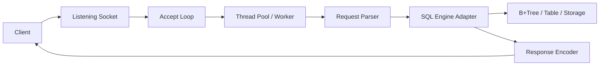

# 04. CSAPP 11 -> SQL API 서버 구현 연결 가이드

수요 코딩회의 핵심은 "네트워크를 학습했다"에서 끝나는 것이 아니라, 그 지식을 이용해 **외부 클라이언트가 호출할 수 있는 SQL API 서버**를 만드는 것입니다.

## 1. 이번 주 구현 문제를 한 줄로 바꾸면

```text
Tiny / Proxy에서 배운 요청-응답 서버 구조를
기존 SQL 엔진 앞단의 네트워크 인터페이스로 바꿔 붙이는 일
```

즉 본질은 다음과 같습니다.

- Tiny:
  정적/동적 웹 컨텐츠를 반환하는 HTTP 서버
- Proxy:
  요청을 받아 다른 서버로 전달하는 중간 서버
- SQL API 서버:
  요청을 받아 내부 SQL 엔진으로 전달하고 결과를 반환하는 서버

## 2. 최소 아키텍처



## 3. CSAPP 11에서 바로 가져올 수 있는 것

### Client-Server 모델

가져올 것:

- 요청을 받아 자원을 조작하고 응답하는 기본 구조

SQL API 서버로 치환:

- 자원 = 테이블, 인덱스, 레코드
- 요청 = SQL 질의
- 응답 = 결과 집합 또는 에러

### Sockets Interface

가져올 것:

- `Open_listenfd`
- `Accept`
- `read / write`
- client address logging

SQL API 서버로 치환:

- 클라이언트 연결 수락
- 요청 데이터 수신
- 응답 데이터 전송

### Tiny

가져올 것:

- 요청 파싱 -> 처리 -> 응답
- 함수 분리 구조

SQL API 서버로 치환:

- `read_request`
- `parse_request`
- `dispatch_query`
- `send_response`

## 4. 수요일 구현용 현실적인 범위

시간이 제한되어 있으므로 아래 순서로 구현하는 것이 현실적입니다.

### 1단계

- 서버 기동
- 포트 리슨
- 클라이언트 한 명 요청 처리

### 2단계

- 요청에서 SQL 문자열 꺼내기
- 기존 SQL 엔진 함수 호출
- 성공/실패 응답 반환

### 3단계

- thread pool 추가
- 여러 요청 병렬 처리

### 4단계

- 에러 처리
- 간단한 테스트
- README 데모 정리

## 5. 추천 요청 형식

시간이 매우 부족하면 가장 단순한 API를 선택하는 편이 낫습니다.

### 추천안 A: HTTP 기반 단일 엔드포인트

```text
POST /query
Body: SQL 문자열
```

장점:

- Tiny / HTTP 지식과 바로 연결됨
- curl로 테스트 쉬움
- 발표하기 쉬움

### 추천안 B: TCP 텍스트 프로토콜

```text
client -> "SELECT * FROM users;\n"
server -> 결과 문자열
```

장점:

- 구현 단순
- 파서 부담 적음

단점:

- "API 서버" 발표 시 HTTP 기반보다 설득력이 약할 수 있음

## 6. thread pool 관점에서 꼭 알아야 하는 것

수요일 요구사항은 요청마다 스레드를 배정해 병렬 처리하는 것입니다.

따라서 최소한 아래를 알아야 합니다.

- 메인 스레드는 `accept`만 담당
- 들어온 연결 혹은 요청을 작업 큐에 넣음
- worker thread가 큐에서 작업을 꺼냄
- SQL 엔진 호출
- 응답 작성 후 반환

주의점:

- 공유 메모리 접근
- B+Tree / 버퍼 / 전역 상태
- 로그 출력 interleaving
- 캐시나 세션 구조가 있다면 race condition

## 7. 구현 전 반드시 결정할 것

- 요청 형식은 HTTP인가, 단순 TCP 텍스트인가
- 응답 형식은 plain text인가, JSON 비슷한 문자열인가
- thread pool 크기는 몇 개인가
- SQL 엔진 호출 함수의 입력/출력 형식은 무엇인가
- 에러를 어떤 형태로 반환할 것인가

## 8. 최소 테스트 목록

- 서버가 뜬다
- 정상 SQL 1개가 성공한다
- 잘못된 SQL에 에러를 돌려준다
- 동시에 여러 요청을 보냈을 때 응답이 온다
- 서버가 죽지 않는다

## 9. 설명 가능해야 하는 핵심 로직

발표에서 반드시 설명할 수 있어야 하는 부분:

- 왜 `accept`와 worker 처리를 분리했는가
- 네트워크 레이어와 SQL 엔진 레이어를 어떻게 분리했는가
- 어떤 동시성 문제를 고려했는가
- 어떤 테스트로 신뢰성을 확보했는가

## 10. 구현 우선순위 한 줄 요약

```text
동작하는 최소 API
-> 병렬 처리
-> 검증
-> README 데모 정리
```
