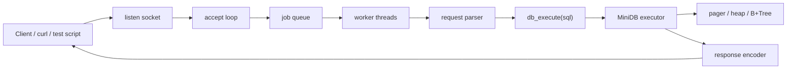

# 08. wk07 MiniDB -> wk08 SQL API Server 전환 정리

이번 주 과제를 어떻게 봐야 하는지 팀 기준으로 한 번 정리해봤다.

결론부터 말하면, 이번 주는 DB 엔진을 처음부터 다시 만드는 주가 아니다.
지난 주에 만든 디스크 기반 MiniDB를 내부 엔진으로 두고, 그 앞에 소켓/HTTP 인터페이스와 병렬 처리 구조를 붙여서 외부 클라이언트가 쓸 수 있는 SQL API 서버로 만드는 주에 가깝다.

---

## 1. 왜 이 정리가 필요한가

지금 우리 상황을 보면 약간 헷갈리기 쉬운 포인트가 있다.

- 지난 주 `wk07_6`에는 디스크 기반 SQL 엔진이 이미 구현돼 있다.
- 그런데 이번 주 새 팀원들 중에는 그 버전을 직접 구현하지 않은 사람도 있다.
- 그러다 보니 이번 주 과제를 잘못 해석하면, 이미 있는 저장 엔진을 다시 만드는 데 시간을 쓰고 정작 API 서버와 동시성 문제는 못 건드릴 수 있다.

그래서 먼저 아래 세 가지를 분명히 하고 가는 게 좋다.

1. 지난 주 버전은 어디까지 구현돼 있었는가
2. 이번 주에 진짜 새로 고민해야 하는 건 무엇인가
3. AI를 써서 협업할 때 어디까지 믿고, 어떻게 검증할 것인가

---

## 2. 지난 주 `wk07_6`는 어디까지 구현돼 있었나

레포: [Jungle-12-303/wk07_6](https://github.com/Jungle-12-303/wk07_6)

레포를 직접 내려받아서 구조, 코드, 테스트까지 확인해봤다.
한 줄로 요약하면 지난 주 버전은 이미 꽤 본격적인 디스크 기반 MiniDB였다.

### 전체 구조

```text
wk07_6/
  include/
    sql/
    storage/
  src/
    sql/
      parser.c
      planner.c
      executor.c
    storage/
      pager.c
      schema.c
      table.c
      bptree.c
    main.c
  tests/
    test_all.c
  tools/
    gen_data.c
  docs/
```

### 이미 구현된 핵심 기능

- 단일 `.db` 파일에 데이터를 저장한다.
- 데이터를 페이지 단위로 관리한다.
- `header page`, `heap page`, `leaf page`, `internal page`, `free page`를 구분한다.
- 실제 row는 heap page에 저장하고, `id -> row_ref` 인덱스는 B+ Tree leaf page에 저장한다.
- `WHERE id = ...`는 인덱스를 타고, 그 외 조건은 테이블 스캔으로 처리한다.
- pager가 frame cache를 들고 `pread()` / `pwrite()`로 디스크 I/O를 직접 관리한다.
- `INSERT`, `SELECT`, `DELETE`, `EXPLAIN`, `.btree`, `.pages`, `.stats` 같은 명령이 있는 REPL이 있다.

즉 지난 주에는 이미 아래 레이어가 있었다.

```text
REPL
-> parser
-> planner
-> executor
-> pager / heap / B+Tree
-> database.db
```

---

## 3. 지난 주 엔진을 이해할 때 꼭 잡아야 하는 포인트

이번 주에 모든 팀원이 `pager.c`, `table.c`, `bptree.c`를 다시 짤 필요는 없지만,
최소한 아래 구조는 머릿속에 있어야 이번 주 작업이 편해진다.

### 3.1 페이지가 기본 단위다

지난 주 엔진은 메모리 포인터 기반 toy 구조가 아니라, 실제 디스크 파일을 페이지 단위로 관리하는 구조였다.

- `page 0`: DB header
- `page 1`: first heap page
- `page 2`: B+ Tree root
- `page 3+`: 추가 heap / index / free pages

여기서 중요한 건 `page`가 저장과 탐색의 기본 단위라는 점이다.

### 3.2 row와 index가 분리돼 있다

- 실제 row 데이터는 heap page에 저장된다.
- 인덱스에는 row 전체가 아니라 `id -> row_ref`만 저장된다.

즉 B+ Tree는 row 자체를 들고 있는 게 아니라, row 위치를 가리키는 역할만 한다.

### 3.3 B+ Tree 자식은 포인터가 아니라 page_id다

메모리 트리처럼 child pointer를 직접 따라가는 게 아니라,
디스크 페이지 번호를 따라 내려간다.

이 관점을 잡아야 지난 주 엔진이 "메모리 자료구조"가 아니라 "디스크 엔진"이었다는 게 보인다.

### 3.4 pager가 디스크 접근을 통제한다

상위 모듈이 파일을 제멋대로 읽고 쓰는 게 아니라,
`pager`를 통해 page load, dirty mark, flush, page alloc/free를 처리한다.

즉 이번 주 동시성 이야기도 결국 pager와 B+ Tree, heap을 어떻게 보호할지로 이어진다.

---

## 4. 지난 주 쿼리 실행은 어떻게 흘렀나

이 부분은 팀원들에게 설명할 때 SQL 문법보다 실행 경로 중심으로 보여주는 게 좋다.

### INSERT

```text
SQL 입력
-> parse
-> executor
-> next_id 할당
-> row serialize
-> heap_insert
-> bptree_insert(id -> row_ref)
-> header 갱신
```

### SELECT WHERE id = N

```text
SQL 입력
-> parse
-> planner가 INDEX_LOOKUP 선택
-> root/internal/leaf 순회
-> row_ref 획득
-> heap row fetch
-> deserialize 후 출력
```

### SELECT WHERE non-indexed field = X

```text
SQL 입력
-> parse
-> planner가 TABLE_SCAN 선택
-> first_heap_page부터 전체 순회
-> alive slot만 deserialize
-> predicate 검사
-> 출력
```

이 정도만 이해해도 이번 주 API 서버를 붙일 때 어디를 감싸야 하는지가 꽤 분명해진다.

---

## 5. 지난 주 버전에서 이미 검증된 것

테스트도 직접 돌려봤다.
현재 테스트 범위는 아래까지 잡혀 있다.

- schema
- pager
- heap
- B+ Tree
- parser
- planner
- persistence
- delete / reuse

실행 결과는 다음과 같다.

```text
=== MiniDB Test Suite ===

[test_schema]
[test_pager]
[test_heap]
[test_bptree]
[test_parser]
[test_planner]
[test_persistence]
[test_delete_reuse]

=== Results: 73/73 passed ===
```

즉 지난 주 버전은 "아이디어만 있던 상태"는 아니고,
적어도 단일 프로세스 REPL 기준으로는 꽤 실제적으로 동작하는 저장 엔진이었다고 봐도 된다.

---

## 6. 지난 주 엔진에 없었던 것

이번 주 범위를 잘 자르려면, 지난 주에 **무엇이 없었는지**도 분명히 봐야 한다.

### 6.1 네트워크 서버는 없었다

지난 주 `main.c`는 소켓 서버가 아니라 REPL이다.

```text
readline()
-> parse()
-> execute()
-> stdout 출력
```

즉 외부 클라이언트가 TCP나 HTTP로 붙는 구조는 아직 없었다.

### 6.2 실제 멀티스레드 환경은 없었다

설계 문서에는 최소 동시성 방향으로 `DB 전역 RW lock` 이야기가 나오지만,
실제 구현은 단일 스레드 REPL 기준이다.

이 말은 곧 아래가 아직 비어 있다는 뜻이다.

- `accept loop`
- `worker thread`
- `thread pool`
- 멀티스레드 기준의 `pager/frame` 보호
- 멀티스레드 기준의 `B+ Tree split/delete` 안정성 검증

즉 지난 주 엔진은 **저장 엔진은 구현돼 있었지만, 서버 동시성 엔진은 아니었다**.

### 6.3 WAL / recovery는 없다

지난 주 pager는 write-back cache지만,
WAL이나 crash recovery는 없다.

이번 주 필수 과제는 아니지만, 저장 엔진을 어디까지 믿을지 이야기할 때는 알아두는 게 좋다.

- 현재는 구조와 동작 학습 중심
- 아직은 복구 가능한 DBMS 단계는 아님

---

## 7. 그래서 이번 주 과제는 정확히 무엇인가

이번 주 과제를 지난 주 버전 위에 얹으면 아래처럼 볼 수 있다.

```text
기존 MiniDB 저장 엔진
+ 소켓/HTTP 서버
+ 요청 파싱과 응답 직렬화
+ thread pool
+ 저장 엔진 동시성 보호
= SQL API 서버
```

즉 이번 주에 새로 고민해야 하는 건 크게 두 덩어리다.

### 7.1 소켓/HTTP 인터페이스 붙이기

외부 클라이언트가 붙을 수 있게:

- listening socket
- accept loop
- request read
- HTTP 또는 텍스트 프로토콜 parsing
- SQL 문자열 추출
- 실행 결과를 응답으로 직렬화

가 필요하다.

### 7.2 동시성 문제 풀기

요청을 병렬로 처리하려면 저장 엔진 쪽 공유 상태를 보호해야 한다.

대표적으로 보호 대상은 아래다.

- `pager frame array`
- `header metadata`
  `next_id`, `row_count`, `next_page_id`, `free_page_head`
- `heap insert/delete`
- `B+ Tree search/insert/delete/split/merge`

결국 이번 주 핵심은 이 말로 정리할 수 있다.

```text
지난 주 저장 엔진을 이해하고,
그 앞에 네트워크 인터페이스를 붙이고,
멀티스레드 환경에서도 안 깨지게 만드는 것
```

---

## 8. 팀원들에게 설명할 때 강조하면 좋은 포인트

### 8.1 이번 주는 저장 엔진을 다시 만드는 주가 아니다

지난 주 `wk07_6`에는 이미 아래가 있었다.

- 디스크 파일
- 페이지 구조
- pager
- slotted heap
- B+ Tree
- parser / planner / executor
- persistence
- 기본 테스트

그래서 이번 주의 primary goal은

```text
기존 엔진을 내부 DB 엔진으로 재사용하고,
그 위에 API 서버를 얹는 것
```

이라고 보는 게 맞다.

### 8.2 새 팀원이 지난 주 구현을 직접 안 했어도 괜찮다

이번 주에 모든 팀원이 저장 엔진 내부를 완벽히 재구현할 필요는 없다.
대신 아래 정도는 같이 알고 가면 충분하다.

- row는 heap에 저장된다
- 인덱스는 `id -> row_ref` 구조다
- `WHERE id = ...`는 B+ Tree, 나머지는 scan이다
- pager가 디스크 I/O와 cache를 관리한다
- 현재 엔진은 REPL 기준으로 검증됐고, 서버 동시성은 새로 붙여야 한다

즉 이번 주에 필요한 공통 이해 수준은
"전체를 다시 짤 수 있는 수준"이 아니라
"API 서버를 붙일 만큼 내부 계약을 이해하는 수준"이다.

### 8.3 이번 주에 진짜 시간을 써야 하는 건 소켓과 동시성이다

이번 주에 팀이 집중해야 하는 건 아래다.

1. 어떤 프로토콜로 요청을 받을지
2. `thread pool`을 어떻게 붙일지
3. `db_execute(sql)` 경계를 어떻게 만들지
4. 저장 엔진 공유 상태를 어떤 락으로 보호할지
5. 병렬 요청에서도 안 죽는다는 걸 어떻게 검증할지

---

## 9. 구현 범위를 현실적으로 자르면

이번 주 MVP는 아래 정도가 가장 현실적이다.

### 9.1 외부 API

- `GET /health`
- `POST /query`
- request body에 SQL 문자열 전달
- 응답은 JSON 비슷한 문자열 또는 plain text

예시:

```text
POST /query
Body:
SELECT * FROM users WHERE id = 1;
```

### 9.2 내부 실행 경계

서버와 저장 엔진 사이 경계는 최대한 얇게 두는 게 좋다.

```c
int db_execute(const char *sql, char *out_buf, size_t out_cap);
```

서버는:

- 요청 읽기
- SQL 문자열 추출
- `db_execute()` 호출
- 응답 작성

만 책임진다.

저장 엔진은:

- parse / plan / execute
- pager / heap / bptree
- 결과 문자열 작성

을 책임진다.

이 경계가 있어야 네트워크 담당과 엔진 담당이 병렬로 움직일 수 있다.

### 9.3 동시성은 어디서 실제로 터질까

이번 주에 제일 조심해야 하는 건 "동시성"이라는 말을 너무 크게만 보는 거다.
실제로는 문제가 나는 지점이 몇 군데로 꽤 구체적이다.

#### 9.3.1 header 메타데이터 경쟁

예를 들어 두 worker가 동시에 `INSERT`를 처리한다고 해보자.

둘 다 거의 동시에 아래 값을 읽을 수 있다.

- `next_id`
- `row_count`
- `next_page_id`
- `free_page_head`

락이 없으면 이런 일이 생긴다.

```text
worker A: next_id = 101 읽음
worker B: next_id = 101 읽음
worker A: id=101로 insert
worker B: id=101로 insert
```

그러면 중복 key가 나거나,
한쪽이 다른 쪽 갱신을 덮어써서 `row_count` 같은 값도 틀어질 수 있다.

즉 header는 "메타데이터니까 가볍다"가 아니라,
오히려 공유 쓰기가 가장 많이 몰리는 위험한 지점이다.

#### 9.3.2 heap / free slot 경쟁

heap insert와 delete 쪽도 위험하다.

예를 들어 두 worker가 같은 free slot을 동시에 재사용하려고 하면:

- 둘 다 같은 slot을 비어 있다고 판단
- 둘 다 같은 위치에 row를 써버림
- 마지막에 쓴 쪽만 남고 데이터가 꼬일 수 있음

delete와 insert가 동시에 붙으면:

- 한쪽은 slot을 tombstone 처리
- 다른 한쪽은 그 slot을 재사용
- 순서가 꼬이면 fetch 시 이상한 row를 읽을 수 있음

즉 heap은 row 데이터만 보호하면 되는 게 아니라,
slot 상태와 free slot 체인까지 같이 보호해야 한다.

#### 9.3.3 B+Tree 구조 경쟁

트리 쪽은 더 위험하다.

단순 search만 있는 게 아니라:

- leaf insert
- duplicate key 검사
- split
- parent 승격
- delete 후 merge / borrow

같은 구조 변경이 들어간다.

예를 들어 두 worker가 같은 leaf에 동시에 insert하면:

- 둘 다 "여기 공간이 있다" 또는 "여기서 split해야 한다"라고 판단
- key_count, entry 배열, sibling link를 동시에 갱신
- 운이 나쁘면 트리 구조 자체가 망가짐

이건 SQL 결과가 틀리는 정도가 아니라,
인덱스 파일 구조가 깨지는 문제라 훨씬 위험하다.

#### 9.3.4 pager / frame cache 경쟁

여기가 생각보다 중요하다.
겉으로는 `SELECT`가 읽기라서 안전해 보여도,
실제로 pager cache는 읽기 때도 내부 상태를 바꾼다.

예를 들어 `pager_get_page()`만 해도 보통 아래를 건드린다.

- `pin_count`
- `used_tick`
- `cache hit / miss 통계`
- frame 선택 상태

즉 읽기 스레드 두 개가 동시에 들어와도
cache metadata는 같이 수정될 수 있다.

이 말은 곧:

```text
SELECT 두 개가 동시에 실행된다
= SQL 의미상 read-read라 안전해 보인다

하지만

pager 내부에선 pin_count, used_tick, stats를 동시에 건드릴 수 있다
```

그래서 "읽기끼리는 락 없이 괜찮다"라고 단순하게 보면 안 된다.

#### 9.3.5 flush / eviction 경쟁

cache가 있으면 flush와 eviction도 같이 생각해야 한다.

예를 들어 한 worker가 어떤 page를 수정하고 있는데,
다른 쪽에서 victim frame을 고르거나 flush를 시작하면:

- 아직 쓰는 중인 page가 디스크로 나갈 수 있고
- pin_count 판단이 틀리면 사용 중인 frame을 쫓아낼 수도 있고
- half-written 상태가 flush될 수도 있다

지금 엔진은 원래 단일 스레드 REPL 기준으로 만들어졌기 때문에,
이런 경합은 아직 전제로 두고 짜여 있지 않다.

#### 9.3.6 디버그 통계도 공유 상태다

은근히 놓치기 쉬운 게 `.debug`용 통계다.

- page_loads
- cache_hits
- cache_misses
- pages_flushed

이 값들도 여러 요청이 동시에 돌면 서로 섞인다.
그러면 디버그 출력이 틀릴 뿐 아니라,
잘못 건드리면 메모리 경쟁 지점이 하나 더 늘어난다.

그래서 이 값은:

- 요청별 지역 변수로 빼거나
- 최소한 별도 보호를 두거나
- 이번 주에는 동시 실행 중 상세 통계를 끄는 식

으로 정리하는 게 낫다.

### 9.4 그럼 이번 주에는 어디까지 막는 게 현실적일까

이번 주에는 완전한 fine-grained locking보다
먼저 "안 깨지는 상태"를 만드는 게 중요하다.

가장 보수적으로 가면 `DB 전역 mutex`가 제일 안전하다.

```text
모든 SELECT / INSERT / DELETE
-> mutex lock
-> db_execute()
-> unlock
```

장점은 단순하다.

- 구현이 가장 빠르다
- pager / heap / bptree / header 경합을 한 번에 막는다
- cache metadata 경쟁도 같이 막는다

단점도 분명하다.

- read-read 병렬성이 없다
- thread pool이 있어도 엔진은 사실상 직렬 실행된다

그래서 이번 주에 "병렬 요청을 받는다"는 모습은 보여주되,
"읽기끼리 어느 정도 같이 돈다"까지 챙기고 싶으면 그 다음 단계로 간다.

### 9.5 현실적인 1차 선택: 엔진 RW lock + pager/cache 보호

문서에서 말한 `DB 전역 RW lock`을 유지하려면,
한 가지를 같이 인정해야 한다.

```text
엔진 RW lock만으로는 충분하지 않다.
pager/cache 내부의 mutable metadata도 따로 보호해야 한다.
```

즉 현실적인 최소 구조는 아래처럼 보는 게 맞다.

#### 엔진 레벨

```text
SELECT 계열      -> rdlock
INSERT/DELETE    -> wrlock
```

이 락은 SQL 의미와 저장 구조 변경을 크게 보호한다.

#### cache 레벨

별도로 아래를 보호하는 mutex가 하나 더 필요하다.

- frame table 탐색/삽입
- `pin_count`
- `used_tick`
- victim 선택
- dirty flush / eviction
- cache stats

즉:

```text
엔진 락
= "이 요청이 읽기냐 쓰기냐"를 구분하는 큰 락

cache 락
= "pager 내부 메타데이터"를 지키는 작은 락
```

이렇게 두 층으로 보는 게 훨씬 이해하기 쉽다.

### 9.6 이번 주 기준 추천안

정리하면 이번 주 선택지는 사실 세 가지다.

#### 선택지 A. global mutex

가장 안전하다.

- 구현 제일 빠름
- 버그 제일 적음
- 병렬 요청은 queue/thread pool 수준에서만 보임

#### 선택지 B. engine rwlock + pager mutex

이번 주에 가장 균형이 좋다.

- read-read는 일부 허용 가능
- write는 직렬화
- cache metadata 경쟁도 따로 막을 수 있음

대신 구현할 때는 "읽기라도 pager 내부 상태는 바뀐다"는 걸 계속 기억해야 한다.

#### 선택지 C. page latch / finer-grained lock

실무적으로는 더 좋을 수 있지만,
이번 주에는 구현 리스크가 크다.

### 9.7 왜 처음부터 page latch까지 가지 않나

`page latch`는 물리적인 page/B+ Tree 구조를 짧게 보호하는 내부 락인데,
이번 주에는 이 단계까지 가면 구현 리스크가 커진다.

특히 아래 경로가 위험하다.

- leaf split
- internal split
- delete 후 merge / borrow
- free page list 조작
- LRU victim 교체와 flush

그래서 이번 주 추천 순서는 아래다.

1. `global mutex` 또는 `engine rwlock + pager mutex`로 먼저 안 깨지는 상태 확보
2. 서버와 thread pool 먼저 완성
3. 병렬 요청 smoke test 확보
4. 시간이 남으면 그 뒤 finer-grained lock 검토

### 9.8 캐시까지 같이 봐야 이해가 쉬운 이유

이번 주 동시성 문제를 이해할 때 cache를 따로 떼서 보면 오히려 헷갈린다.

왜냐하면 실제로는:

- SQL 요청은 executor를 타고
- executor는 heap / bptree를 부르고
- heap / bptree는 pager를 부르고
- pager는 frame cache metadata를 바꾼다

즉 요청 하나가 아래를 전부 같이 건드린다.

```text
request
-> SQL 실행 상태
-> B+Tree / heap 구조
-> pager
-> frame cache
-> flush / eviction 후보
```

그래서 이번 주 동시성은
"SQL 락만 잘 걸면 끝"도 아니고,
"cache만 안전하면 끝"도 아니다.

실제로는:

```text
저장 엔진 구조 보호
+ cache metadata 보호
+ flush/eviction 경쟁 방지
```

를 같이 봐야 한다.

---

## 10. 권장 아키텍처



서버 쪽 책임은 아래 정도로 자를 수 있다.

- 포트 리슨
- 요청 수락
- 큐에 작업 넣기
- worker가 요청 파싱
- `db_execute()` 호출
- 응답 전송

엔진 쪽 책임은 아래다.

- SQL 파싱
- 플랜 생성
- 디스크 기반 실행
- 결과 포맷팅

---

## 11. AI를 어떻게 써서 협업할까

이번 주는 "AI가 코드를 대신 쳐 준다" 정도로 쓰면 오히려 더 위험할 수 있다.
AI를 역할이 분리된 협업 파트너처럼 써야 한다.

### 11.1 기본 원칙

내가 보기에는 아래 네 가지가 중요하다.

1. 경계를 먼저 정한다
2. AI마다 책임 파일과 역할을 나눈다
3. 결과물보다 검증 게이트를 먼저 만든다
4. 마지막 통합과 승인 책임은 사람이 진다

### 11.2 AI 역할 분리 예시

#### AI 1. 서버 담당

책임:

- `server.c`
- `thread_pool.c`
- request/response parser
- socket lifecycle

입력 계약:

- `db_execute(sql, out_buf, cap)`만 호출 가능
- 엔진 내부 자료구조는 직접 접근하지 않음

#### AI 2. 엔진 어댑터 담당

책임:

- REPL 기반 엔진을 API 호출 기반 함수로 감싸기
- `db_execute()` 구현
- 결과 문자열 직렬화

입력 계약:

- 네트워크 코드는 모름
- SQL 실행 성공/실패를 명시적인 반환값으로 제공

#### AI 3. 동시성/테스트 담당

책임:

- 락 삽입 위치 설계
- regression test
- multi-request smoke test
- edge case 시나리오

입력 계약:

- API 명세와 엔진 인터페이스만 보고 테스트 작성

### 11.3 역할을 어떻게 나누는 게 좋은가

여기서 중요한 건 "기능 이름"으로 나누는 게 아니라
"어떤 입력을 받아서 어떤 출력을 보장하는 모듈인가"로 나누는 것이다.

예를 들어 "B+Tree 검색 로직 담당"이라고 하면 너무 좁거나 애매할 수 있다.
그보다는 아래처럼 경계를 잡는 게 낫다.

#### 11.3.1 좋은 나눔 기준

- 소유 파일이 비교적 명확한가
- 입력과 출력이 함수 수준에서 정리되는가
- 다른 모듈의 내부 상태를 직접 건드리지 않아도 되는가
- 병렬 작업 시 충돌이 적은가

즉 "내가 트리 검색을 맡았으니 캐시까지 다 본다"가 아니라,
"내 모듈이 pager가 주는 API를 사용해서 어떤 결과를 반환하는지"로 자르는 게 좋다.

#### 11.3.2 B+Tree 담당은 어디까지 맡는 게 맞나

질문하신 예시처럼 누군가가 B+Tree 검색/삽입/삭제를 맡는다고 해보자.

이 경우 그 사람이 기본적으로 맡는 범위는:

- `bptree_search`
- `bptree_insert`
- `bptree_delete`
- split / merge / borrow 같은 트리 구조 유지
- `key -> row_ref` 계약 유지

여기까지가 자연스럽다.

반면 아래는 자동으로 같이 가져가면 범위가 너무 커질 수 있다.

- pager 내부 frame eviction 정책
- dirty flush 정책
- free page allocator 전체
- HTTP 응답 포맷
- thread pool

즉 B+Tree 담당은 **트리가 pager를 어떻게 사용하는지**는 알아야 하지만,
**pager/cache의 내부 구현 전체 소유자**가 되는 건 별개다.

정리하면:

```text
B+Tree 담당
= pager API를 사용하는 인덱스 모듈 담당

아님

B+Tree 담당
= 저장 엔진 전체 + 캐시 전체 + 서버까지 전부 담당
```

#### 11.3.3 그럼 pager/cache는 누가 맡나

`pager`, `frame cache`, `page alloc/free`, `header flush` 같은 건
오히려 따로 떼서 보는 게 좋다.

이 영역은 저장 엔진의 공통 인프라에 가깝다.

즉 역할을 이렇게 나누는 편이 더 낫다.

- `storage core 담당`
  `pager.c`, `page_format.h`, `page alloc/free`, frame cache, dirty flush
- `index 담당`
  `bptree.c`, `bptree.h`, key 탐색/삽입/삭제, split/merge
- `heap/table 담당`
  `table.c`, heap insert/fetch/delete/scan, row_ref 계약

이렇게 나누면 B+Tree 담당이 캐시 전체를 같이 떠안지 않아도 된다.

### 11.4 사람 기준으로는 어떻게 나누면 좋나

이번 과제에서는 아래처럼 나누는 게 제일 안정적이다.

#### 11.4.1 서버/네트워크 담당

소유 범위:

- `server.c`
- `thread_pool.c`
- request parser
- response encoder

입력:

- raw socket / HTTP request

출력:

- SQL 문자열
- 최종 HTTP 응답

의존 계약:

- `db_execute(sql, out_buf, cap)`만 호출

이 담당은 엔진 내부 자료구조를 직접 건드리지 않는 게 좋다.

#### 11.4.2 SQL 어댑터 담당

소유 범위:

- `db_execute()`
- REPL 흐름을 API 호출형으로 감싸는 코드
- 결과 문자열 포맷

입력:

- SQL 문자열

출력:

- 성공/실패 코드
- 결과 문자열

의존 계약:

- parser / planner / executor 호출
- 서버 코드는 모름

이 역할은 서버와 저장 엔진 사이의 접착제 역할이다.

#### 11.4.3 저장 엔진 코어 담당

소유 범위:

- `pager.c`
- `table.c`
- `bptree.c`
- 필요한 락 위치 설계

입력:

- row serialize 결과
- key / row_ref
- page_id

출력:

- row_ref
- fetched row data
- key search result

이 담당은 다시 세부로 나눌 수 있다.

- `pager / cache 담당`
- `heap 담당`
- `B+Tree 담당`

팀 인원이 충분하면 이쪽이 가장 깔끔하다.

#### 11.4.4 테스트/검증 담당

소유 범위:

- regression test
- API smoke test
- concurrency test script
- edge case 목록

입력:

- API 명세
- 엔진 인터페이스

출력:

- 재현 가능한 테스트
- 실패 케이스 보고

이 역할은 구현과 겹치지 않는 별도 시야를 가져가는 게 좋다.

### 11.5 팀 인원에 따라 나누는 예시

#### 3명이면

- 1명: 서버 + thread pool
- 1명: `db_execute()` + SQL 어댑터 + 결과 포맷
- 1명: 저장 엔진 코어 + 동시성 보호

테스트는 셋이 같이 보되, 마지막 사람 한 명이 스크립트를 정리하는 식이 좋다.

#### 4명이면

- 1명: 서버 / HTTP / thread pool
- 1명: SQL 어댑터 / executor 연결
- 1명: pager / heap
- 1명: B+Tree / 동시성 / 테스트

이 구성이 가장 안정적이다.

#### 5명 이상이면

- 서버
- thread pool / queue
- SQL 어댑터
- pager / heap
- B+Tree / 락 / 테스트

이 정도로 더 쪼갤 수 있다.

### 11.6 AI에게 줄 프롬프트도 계약형이어야 한다

좋은 프롬프트는 장황한 설명보다 경계가 중요하다.

예를 들면 이런 식이 좋다.

```text
소유 범위:
- src/server/*
- include/server/*

수정 금지:
- src/storage/*
- src/sql/*

입력 계약:
- int db_execute(const char *sql, char *out_buf, size_t out_cap)

목표:
- POST /query 구현
- thread pool 기반 요청 처리
- 잘못된 요청에 4xx/5xx 응답

검증:
- make
- curl smoke test 3개
- 동시 20요청에서 프로세스가 죽지 않을 것
```

이렇게 해야 AI가 엉뚱한 파일까지 건드리는 일이 줄어든다.

---

## 12. AI가 만든 결과를 어디까지 믿을 수 있나

짧게 말하면:

```text
AI가 만든 코드는 초안으로는 믿을 수 있지만,
검증 없는 결과물로는 믿을 수 없다.
```

결국 믿을 수 있는 건 모델의 자신감이 아니라 아래 게이트를 통과했는지다.

- 컴파일 성공
- 기존 회귀 테스트 통과
- 새 기능 테스트 통과
- 병렬 요청 smoke test 통과
- 실패 시나리오에서 서버가 죽지 않음
- 코드 리뷰에서 계약 위반이 없음

즉 AI 산출물의 신뢰는 "모델이 그럴듯하게 말했는가"보다
"우리가 만든 검증을 통과했는가"에서 나온다.

---

## 13. 이번 주에 꼭 필요한 검증 게이트

### 1단계. 빌드 게이트

- `make`
- 경고 없는 빌드

### 2단계. 기존 엔진 회귀 게이트

- 저장 엔진 테스트 재실행
- 최소한 지난 주 동작이 깨지지 않았는지 확인

### 3단계. API smoke test

- `GET /health`
- 정상 SQL 1개
- 잘못된 SQL 1개

### 4단계. 동시성 smoke test

- 동시에 10~20개 요청
- read-read
- read-write
- write-write

### 5단계. 실패 주입

- 빈 body
- 너무 긴 body
- SQL parse error
- 클라이언트 중간 종료

---

## 14. 정말 짧게 팀원들에게 말하면

아주 짧게 정리하면 이 말이면 된다.

```text
지난 주 wk07_6은 이미 디스크 기반 SQL 엔진까지 구현한 버전이다.
단일 .db 파일, pager, slotted heap, B+Tree, parser/planner/executor, persistence,
테스트까지 있었다.

이번 주는 그 엔진을 다시 만드는 게 아니라,
그 앞에 소켓/HTTP 서버와 thread pool을 붙여
외부 클라이언트가 병렬로 SQL을 호출할 수 있게 만드는 주다.

그래서 이번 주의 핵심 고민은
1) 요청을 어떤 API로 받을지,
2) DB 실행 경계를 어떻게 자를지,
3) 멀티스레드에서 엔진을 어떤 락으로 보호할지,
4) 그 결과를 어떤 테스트로 검증할지
다.

AI는 역할별로 분리해서 쓰되,
검증을 통과하기 전까지는 초안으로만 본다.
```

---

## 15. 결론

이번 주를 잘 풀려면 문제를 정확히 다시 써야 한다.

```text
문제:
새 DBMS를 처음부터 다시 만드는 것

이건 아님

정확한 문제:
이미 있는 디스크 기반 MiniDB를 내부 엔진으로 삼아
외부 클라이언트가 사용할 수 있는
병렬 SQL API 서버로 감싸는 것
```

이렇게 보고 나면 우선순위도 자연스럽게 정리된다.

- 지난 주 엔진은 "완벽히 재구현"이 아니라 "이해하고 재사용"
- 이번 주 신규 범위는 "소켓 + API + thread pool + 동시성"
- AI는 "자동 타이퍼"가 아니라 "역할 분리된 구현/검증 파트너"

이 기준으로 가면 이번 주 구현 범위도 훨씬 현실적으로 잡히고,
팀원들과도 같은 그림을 놓고 얘기하기 쉬워진다.
