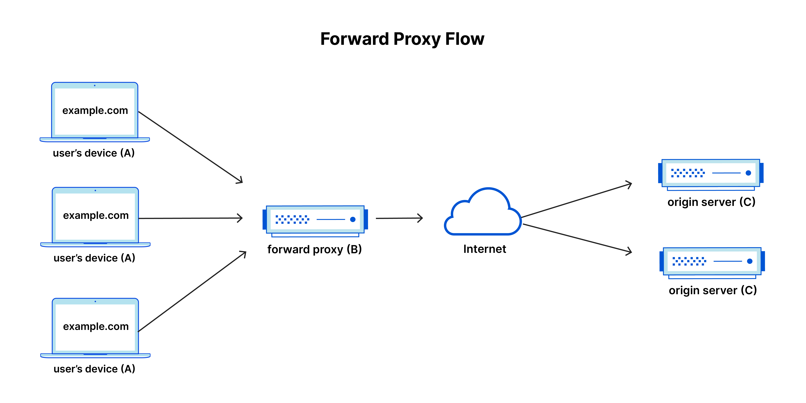
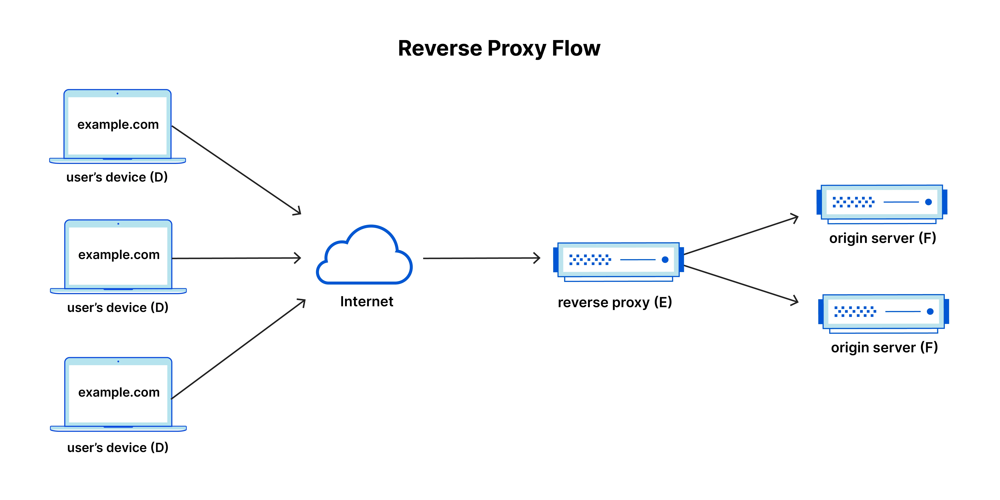

## 프록시

### 정방향 프록시



클라이언트 시스템 앞에 위치하는 서버. 인터넷 사이트 및 서비스에 요청하면, 프로시 서버가 이를 가로채고 중계자처럼 해당 클라이언트를 대신해 웹 서버와 통신한다.

- 주 당국, 기관의 검색 제한을 피하기 위해
- 특정 콘텐츠에 대한 엑세스를 차단하기 위해
- 온라인에서 자신의 신원을 보호하기 위해

### 역방향 프록시


하나 이상의 웹서버 앞에 위치해 클라이언트의 요청을 가로채는 서버. 정방향 프록시는 클라이언트 앞에 위치해 원본 서버가 해당 클라이언트와 직접 통신하지 못하게 하고, 리버스 프록시는 어떤 클라이언트도 원본서버와 직접통신하지 못하게 한다.

- 부하 분산: 단일 서버에 과부하가 걸리는걸 방지하기 위해 트래픽을 고르게 분산하는 부하분산 솔루션을 제공
- 공격으로부터 보호: 웹사이트 or 서비스에 원본 서버의 IP주소를 숨길 수 있다.
- 전역서버 부하 분산: 전 세계 여러 서버가 있는 경우 프록시 서버는 클라이언트를 지리적으로 가까운 서버로 보낸다.
- 캐싱: 리버스 프록시에 콘텐츠를 캐시해 둬 클라이언트는 가까운 프록시 서버의 캐시를 가져와 콘텐츠를 본다.
- SSL 암호화: 각 통신에 대한 암호화 및 해독을 맡겨 원본 서버의 부하를 줄인다.

## HTTPS 차단 원리

https는 원래 통신 내용을 암호화해서 아무도 볼 수 없다.

하지만 https TLS handshake시 목적지 주소 SNI(Server Name Indication)는 평문으로 보내진다.

그래서 통신사는 3계층 장비인 DPI (Deep Packet Inspection)을 도입해서 패킷을 실시간으로 검사해, 차단 목록에 있는 SNI가 발견되면 통신을 끊어버린다.

이 차단을 우회하기 위해 패킷 파편화 기술을 사용한다.

### https 암호화

#### 1. 하이브리드 암호화 (비대칭키 + 대칭키)

- 연산이 느린 비대칭 키 방식을 이용해 대칭 키를 안전하게 교환한 후, 실제 데이터는 교환된 대칭키로 암호화하여 통신한다.

#### 2. TLS 통신


1. 0ms TLS는 기본적으로 TCP 위에서 동작한다. 그래서 TCP 3way handshake가 완료되어야 함.

2. 56ms TCP 연결이 설정되면 클라이언트는 평문으로 TLS 프로토콜 버전, 암호화 세트 목록 등 사양이 담긴 ClientHello를 보낸다.
   - 지원하는 TLS 버전 및 암호화 방식 목록
   - 클라이언트가 생성한 난수
   - 접속하려는 도메인 이름 (SNI - 통신사가 이부분을 감청해 차단)

3. 84ms 서버는 후속 통신을 위해 TLS 프로토콜 버전을 선택하고, 클라이언트가 제공한 암호화 세트 목록에서 하나를 결정한다. 그런 다음 자신의 인증서를 첨부하고 클라이언트에게 응답을 보낸다.
   - 클라이언트가 제시한 목록 중 선택한 암호화 방식
   - 서버가 생성한 난수
   - 서버의 SSL/TLS 인증서 (서버의 공개 키가 포함되어 있음)
4. 112ms 클라이언트 서버 모두 공통 버전과 암호를 협상할수 있다. 클라이언트가 서버가 제공한 인증서에 만족한다고 가정하면 (서버가 보낸 인증서가 신뢰할 수 있는 인증기관CA에서 발급되었는지, 브라우저에 내장된 CA 공개키를 통해 전자서명을 검증한다.), 클라이언트는 RSA 또는 Diffie-Hellman 키 교환을 시작하고, 이후 세션의 대칭 키를 설정하는데 사용된다. 클라이언트와 서버는 모두 동일한 (client random, server random, pre-master secret)을가지고 합의된 알고리즘에 세 가지 값을 넣어 연산하고 동일한 Master Secret (대칭 키를) 도출해 낸다.

5. 140ms 서버는 클라이언트가 보낸 키 교환 매개변수를 처리하며, MAC을 검증하여 메시지 무결성을 확인한 후, 클라이언트에게 암호화된 Finished 메시지를 반환한다.

6. 클라이언트는 협상된 대칭키로 메시지를 복호화하며, MAC(Message Authentication Code)이라는 해시 기반의 무결성 검증 코드를 데이터에 덧붙여 전송한다. 이를 통해 중간자가 데이터를 변조하면, 수신측에서 통신을 폐기한다.

TLS는 그림과 같이 2번의 라운드 트립이 발생해 오버헤드가 발생한다.

### 패킷 파편화

1. 로컬 VPN 생성
   - 앱은 기기 내부에 가짜 가상 망(Local VPN)을 생성한다. 안드로이드나 ios는 보안상 일반 앱이 다른 앱의 인터넷 통신을 훔쳐보거나 건드리지 못하게 막아 두었지만, VPN 권한을 이용해 패킷이 해당 앱을 거쳐가도록 경로를 변경할 수 있다.
2. 패킷 가로채기 및 타겟 확인
   - 앱이 패킷 헤더를 분석한다.
   - HTTPS 통신의 첫 인사 단계인 Client Hello 패킷을 찾아낸다.
3. TCP 데이터 강제 분할
   - 데이터를 1바이트나 2바이트 단위의 작은 청크 단위로 쪼갠다.
   - 그리고 쪼개진 패킷들을 와이파이나 LTE망을 통해 순차적으로 통신사로 날려 보낸다.

## MIME

- 파일이나 데이터 형식을 나타내는 표준 문자열
  형식: `type/subtype`
- type: video, text 같이 데이터 타입에 속하는 일반 카테고리
- subtype: MIME 타입이 나타내는 지정된 타입의 정확한 데이터 종류

다음과 같이 매개변수도 추가할 수 있다. - `type/subtype:parameter=value`

필요 이유: 받은 데이터가 무엇인지 시스템이 정확히 해석하도록 돕기 위해, 파일 확장자만 보고 판단하지 않고, 데이터의 실제 용도를 알려주는 역할

- ex) `text/html`이면 웹페이지로 랜더링, `image/png` 이미지로 표시, `application/json` API로 처리

사용처

1. HTTP 통신: 헤더에 `Content-Type: application/json` 다음과 같이 들어감
2. 파일 업로드: 사용자가 파일을 업로드할 때 서버는 MIME 타입을 보고 허용 or 차단 결정
3. 이메일 첨부파일: MIME가 만들어진 이유

### MIME의 역사 - 이메일에 텍스트말고 다른 데이터를 넣고 싶어서 만들어진 데이터 타입

1. 초기 이메일의 한계: 초기 이메일의 전송 프로토콜 SMTP는 7비트 ASCII 문자만 지원하도록 설계되어 있었음. 이미지, 오디오, 실행파일 같은 바이너리 데이터나 한국어, 한자 같은 비영어권 문자를 전송하려면 발신자가 수동으로 데이터 -> 텍스트로 변환, 수신자가 다시 디코딩해야 했음
2. MIME의 탄생: 이런 통신 제약을 해결하기 위해서 MIME라는 확장 표준이 탄생
3. 이메일에서 웹으로 확장: HTTP 프로토콜에서도 데이터가 어떤 타입인지 식별할 체계가 필요. 이미 만들어져 있는 MIME를 HTTP Content-Type 헤더에 그대로 도입

## telnet

네트워크로 다른 컴퓨터에 원격으로 접속하는 프로토콜
암호화가 되지 않기 때문에, 아이디, 비밀번호등이 평문으로 전송되기 때문에 보안에 매우 취약함

- 포트 열림 확인, 특정 서버의 TCP 연결 테스트, 오래된 장비나 시스템 접속에 사용

모든 인터넷 프로토콜의 트랜잭션을 실행할 수 있다? NO

1. Telnet은 TCP 기반 연결만 쉽게 다룬다. 텍스트 기반 TCP 프로토콜의 요청/응답을 수동으로 테스트한다. UDP 프로토콜에는 적합하지 않다.
2. 바이너리 프로토콜에 부적합하다. 사람 손으로 입력하기 어려운 형식은 Telnet으로 다룰 수 없다.
3. Telnet 자체 프로토콜 형식(IAC 명령)이 끼어들 수 있다. 순수 TCP raw client가 아니고, 특정 바이트 값이 제어명령으로 해석될 수 있다.
4. 현재 서비스는 암호화가 기본이다. 많은 서비스가 TLS 위에서 동작하기 때문에 Telnet만으로는 APP 계층 트랜잭션을 끝까지 수행할 수 없다.

## HTTP/1.0과 HTTP/1.1의 차이

1. Host 헤더 - 과거에는 하나의 IP에 하나의 Host인 경우가 많았지만, 가상 호스트의 등장으로 하나의 IP에 여러 호스트가 운영되는 경우로 Host 헤더가 사실상 강제됨

```
GET /index.html HTTP/1.1
Host: example.com
```

2. 연결 유지 방식 - HTTP/1.0은 요청 1개에 TCP 연결 1개 응답이 끝나면 연결을 닫는다. HTTP/1.1은 지속적으로 요청을 보내기 위해 TCP 연결을 유지해 둔다.
3. 캐시와 프록시 관련 기능 강화 - Cache-Control 헤더, Via, Age, Accept, Accept-Languege, Accept-Encoding, 추가된 상태코드, Range와 같은 다양항 기능들이 추가 됨
4. 파이프라이닝 지원 - 이전에는 요청을 보내면 응답이 올 때까지 기다려야 했지만 응답이 오기전에 여러번 요청이 가능하도록 파이프라이닝 기능을 추가
