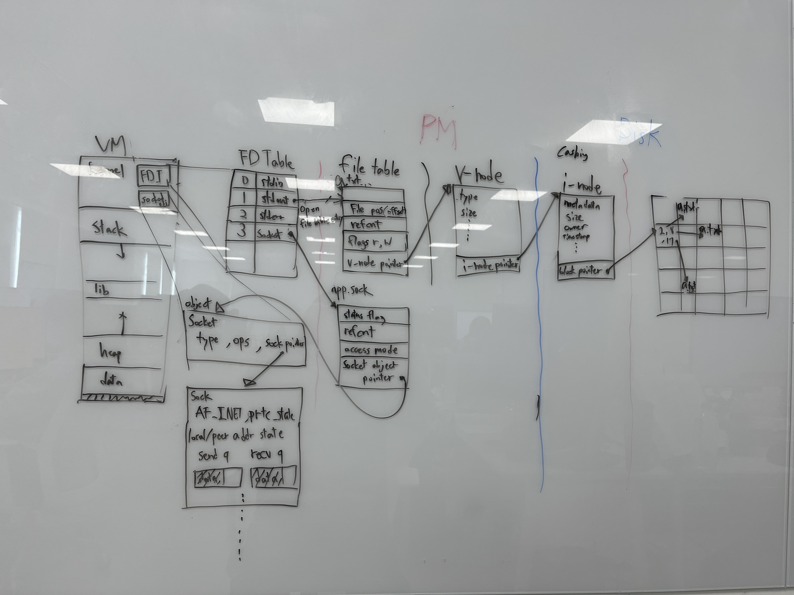

# DON'T EDIT THIS FILE

# PLAYGROUND

통신을 알기 전에 파일을 알아야 함.
모든 것은 파일 -> 주고  받는 데이터도 파일

Unix I/O

커널은 각 프로세스의 최상단에 올라감 각 프로세스는 그 영역을 공유하고 있음

파일의 종류는 두가지 -> 텍스트 파일, 바이너리 파일 -> 텍스트 파일은 ascii 혹은 유니코드 등으로 읽을 수 있음. 하지만 os는 유니코드를 바로 읽을 수 없음. (중간에 번역해주는 작업이 필요한가봄)

유닉스에서 줄 바꿈 인식하는 문자 '\n' (0xa)
윈도우는 '\r\n' (0xd 0xa)
\n은 line feed(LF)    \r은 Carriage return(CR) -> 타자기에서 키칭

물리적 장치 번호 -> 하드 디스크의 몇 번 파티션인지, usb에 있는지 등
inode -> 파일 크기, 소유자, 접근 권한, 물리적 섹터 위치 등 저장되어있음 (추가로 파일 이름은 들어있지 않음)
하드 링크 -> 이름표 하드링크에 여러개 이름표를 가지고 있는 경우 -> a.c와 b.c로 가지고 있는경우 a.c를 수정하면 b.c를 열었을 때 수정된걸로 보임 ln 명령어로 새로 이름표 만들 수 있음 -> ., .. 디렉토리가 하드 링크의 예시

파일 삭제 = 더이상 참조하고있는 i-node가 없다

네트워크로 갔을 때 Unix I/O, stdio 는 적합하지 않다는 것을 알 수 있을 것임

RIO가 네트워크에서 편리

웹 서버 구현할 때 패킹 언패킹 고려x -> OS내부에 TCP/IT 소프트웨어가 있어서 알아서 해줌
소켓은 단순히 번호가 매겨진 열린 파일에 불가함

호스트 바이트와 네트워크 바이트
	호스트 바이트는 호스트의 컴퓨터에서 사용하고 있는 CPU에 따라 데이터가 저장되는 방식이 다름. 호스트 바이트가 사용하는 방식에 따른 데이터를 호스트 바이트라고 함. 보통 우리가 사용하는 CPU는 리틀 엔디안을 사용(거꾸로 넣기) 하지만 네트워크는 빅엔디안을 사용하기 때문에 이를 변환하는 과정이 필요. -> 이 때 사용하는 함수가 htonl, htons, ntohl, ntohs
	여기서 l은 long(4바이트), s는 short(2바이트)

fopen
	1. socket()
	2. bind()
	3. listen()

# FILE I/O

